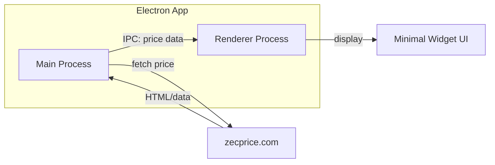

# ZEC Price Desktop Widget

## Overview

Create a lightweight Electron desktop application that displays the current Zcash (ZEC) price fetched from zecprice.com. The widget will have a minimal, clean aesthetic with automatic price updates.

## Architecture




## Data Fetching Strategy

Since zecprice.com may not have a documented public API, we'll use one of these approaches:

1. **Primary**: Scrape the price directly from zecprice.com's HTML using `node-fetch` or Electron's `net` module
2. **Fallback**: If the site structure changes, we can pivot to CoinGecko's free API as a backup data source

## Project Structure

```javascript


zec/
├── package.json          # Electron + dependencies
├── main.js               # Electron main process (data fetching)
├── preload.js            # Secure bridge between main/renderer
├── renderer.js           # UI logic and updates
├── index.html            # Widget markup
├── styles.css            # Minimal styling
└── README.md             # Setup instructions
```


## Implementation Steps

### 1. Initialize Electron Project

- Create `package.json` with Electron as the main dependency
- Add `node-fetch` (or use built-in `net`) for HTTP requests
- Add `cheerio` for HTML parsing (if scraping)

### 2. Build Main Process (`main.js`)

- Create a small, frameless window (widget-style)
- Implement price fetching function that:
- Makes HTTP request to zecprice.com
- Parses the response to extract the current ZEC/USD price
- Set up IPC to send price data to renderer
- Configure auto-refresh interval (e.g., every 60 seconds)

### 3. Create Preload Script (`preload.js`)

- Expose a secure API for the renderer to receive price updates
- Use `contextBridge` for security best practices

### 4. Design Minimal UI (`index.html` + `styles.css`)

- Small, compact window (~300x150px)
- Display: ZEC logo/icon, current price in USD, last updated timestamp
- Clean typography with monospace numbers for the price
- Subtle loading state during refresh
- Optional: always-on-top toggle

### 5. Implement Renderer Logic (`renderer.js`)

- Listen for price updates from main process
- Update DOM with new price data
- Handle loading/error states gracefully

## Technical Decisions

| Aspect | Choice | Rationale |

|--------|--------|-----------|

| Window style | Frameless, compact | Widget-like feel |

| Update interval | 60 seconds | Balance between freshness and server load |

| Error handling | Show stale price + indicator | Keep widget useful even on failures |

| Styling | System fonts, neutral colors | Minimal aesthetic per your preference |

## Potential Challenges

- **Site structure changes**: zecprice.com's HTML structure could change, breaking the scraper. Mitigation: modular parsing logic that's easy to update.